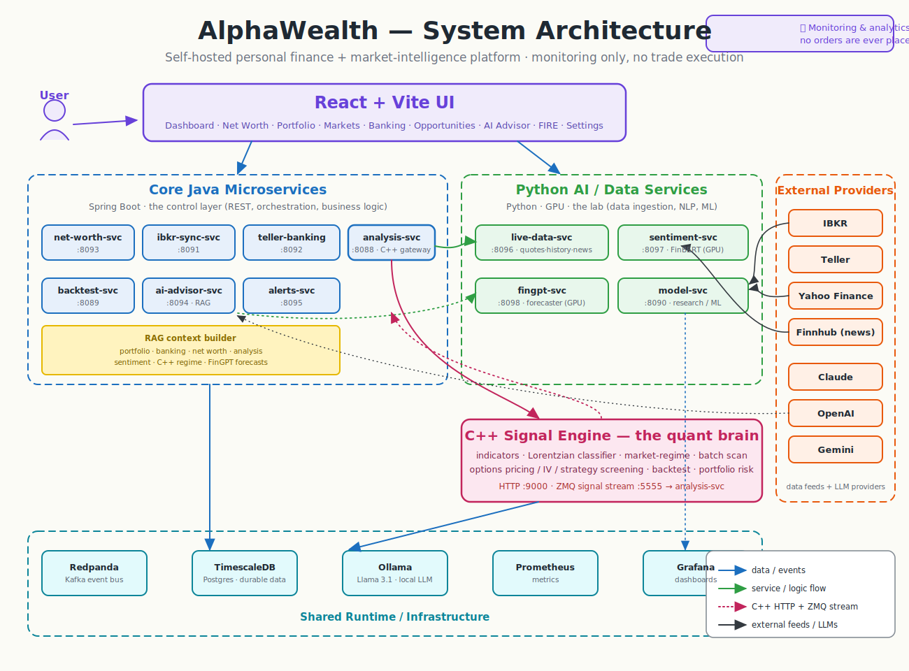

# AlphaWealth

AlphaWealth is a self-hosted personal finance and market research command center. It brings together live market data, portfolio analysis, bank-account spending, IBKR brokerage snapshots, AI research tools, sentiment analysis, technical signals, and backtesting into one local dashboard.

The app is designed for monitoring, research, and decision support. By default it does not place trades. Its job is to help you see your money clearly, understand what is moving markets, test ideas before trusting them, and ask an AI advisor questions using your own financial context.

## Architecture

<p align="center">
  
</p>

AlphaWealth is a polyglot microservice stack — each language is used for what it is best at:

| Layer | Tech | What it does here |
|-------|------|-------------------|
| **C++** — the quant brain | `cpp-signal-engine` | The fast, deterministic finance core: technical indicators, the Lorentzian classifier, market-regime classification, options pricing / implied vol / strategy screening, portfolio risk, batch scans across many tickers, and backtesting. Exposes HTTP on `:9000` and broadcasts signals over a ZMQ stream on `:5555`. Anything that needs speed, batching, or exact math lives here. |
| **Java** — the control layer | Spring Boot services | Orchestration and stable production APIs: REST endpoints, wiring the UI to the C++/Python/data services, IBKR + banking + net-worth business logic, the AI advisor's RAG orchestration, alerting, and graceful fallbacks when a downstream service is down. |
| **Python** — the lab | FastAPI / GPU services | Research and ML: yfinance/Finnhub data ingestion, FinBERT news sentiment, entity/ticker extraction, the FinGPT forecaster, and the research/model service. Where new strategies are prototyped before being moved into C++. |
| **JavaScript / React** — the experience | React + Vite | The 9-page UI: charts, the Markets terminal, the Opportunities scanner, evidence panels, portfolio/banking views, and the AI advisor chat. It displays decisions, evidence, and controls — the heavy finance math lives in C++. |
| **PostgreSQL / TimescaleDB** | durable data | Users' watchlists, stored signals, historical news metadata, net-worth snapshots, and time-series application data. |
| **Kafka (Redpanda)** | event flow | Event bus for IBKR positions, banking transactions, net-worth snapshots, and "new signal" events — produced and consumed across services (`net.worth.snapshots`, `banking.transactions`, `ibkr.*`, `teller.balances`). |
| **Redis** | fast cache | Provisioned for latest-price / scan-result caching and short-lived state. Reserved capacity — not yet wired into the services. |
| **Ollama** | local LLM | Llama 3.1 served locally so the AI advisor works for free, with cloud providers (Claude / OpenAI / Gemini) as routed alternatives. |
| **Prometheus + Grafana** | observability | Service health, latency, GPU/CPU/memory, and data-freshness dashboards. |

> The diagram and tables describe a self-hosted, monitoring-and-analytics platform. **No orders are ever placed** — AlphaWealth reads and analyzes, it does not execute trades.

## Why This App Is Useful

Most personal finance apps show only one slice of the picture: bank balances, brokerage holdings, budgets, or stock charts. AlphaWealth is useful because it connects those layers.

It lets you answer questions like:

- How much am I worth across brokerage, bank accounts, and manual assets?
- Which parts of my portfolio are driving risk?
- What is happening in the market right now?
- Are my bank transactions showing healthy cash flow?
- What does news sentiment look like for a symbol before a trade?
- Would this strategy have worked historically?
- Is this pattern seasonal, technical, news-driven, or just noise?
- Can an AI advisor summarize my financial picture without sending everything to a third-party finance app?

The app is also useful as a research platform. It now includes timestamp-safe news storage, FinBERT sentiment scoring, lightweight entity extraction, Lorentzian Classification indicators, and hooks for future FinRL strategy research.

## What You Get

### Dashboard

The dashboard is the home base. It summarizes the main parts of your financial life in one screen: market status, net worth, portfolio value, banking activity, and AI-driven shortcuts.

Why it helps:

- You do not need to jump between brokerage, bank, and charting apps to know what is going on.
- It gives you a quick read on whether markets are live, stale, simulated, or unavailable.
- It surfaces the most important numbers first, so you can decide where to drill in.
- It acts like a command center instead of a static report.

### Net Worth

The Net Worth page combines investment balances, bank balances, liabilities, and manual entries into one view.

Why it helps:

- Net worth is the real scoreboard for long-term personal finance.
- Brokerage gains can hide cash-flow problems; bank balances can hide portfolio risk. Seeing them together is more honest.
- The app can combine IBKR data, Teller bank data, and manually tracked assets.
- Historical snapshots make it easier to see whether your total financial position is actually improving.

### Portfolio Analyzer

The Portfolio page focuses on brokerage holdings and portfolio risk. It can read IBKR snapshots, show portfolio value, analyze allocation, estimate volatility, and support rebalancing-style decisions.

Why it helps:

- A portfolio is not just a list of tickers. Concentration, correlation, volatility, and exposure matter.
- It helps you understand whether your portfolio depends too heavily on one stock, sector, or market regime.
- IBKR integration allows the app to use real account data when the Client Portal Gateway is running.
- When IBKR is unavailable, the app can keep showing the last-known snapshot instead of becoming useless.

### Markets — charting terminal

The Markets page is a full charting terminal built on TradingView Lightweight Charts:

- **Candlestick / bar / area / baseline** chart types with all timeframes (1D · 5D · 1M · 3M · 6M · 1Y · 5Y).
- **Indicators** — SMA 20, EMA 9, VWAP overlays, plus **RSI and MACD in dedicated stacked panes**.
- **On-chart context** — support/resistance lines, EMA/SMA crossover buy/sell markers, an entry/stop/target trade-plan overlay, a crosshair OHLC legend, log-scale toggle, and a symbol watermark.
- **Editable watchlist** (persisted in Postgres, with a localStorage fallback) and ticker search.
- **Evidence panel** — signal, momentum (RSI/MACD), key levels, patterns, seasonality, and the C++ market regime.
- **Bottom tabs** — News (TradingView Top Stories), Consensus (TradingView technical gauge), Options ideas, Financials (your snapshot + TradingView fundamentals), Backtest, and an AI Memo.
- A **Lite / Pro toggle** swaps the native chart for the full TradingView Advanced chart (drawing tools, Fibonacci, 100+ indicators).
- A `dataMode` indicator (live / stale / simulated / error / disconnected) prevents mistaking fallback data for live data.

### Opportunities — explainable scanner

The Opportunities page replaces the old separate Patterns / Seasonality / Options / Backtest pages with a single ranked, explainable scanner.

- Scores each watchlist symbol across ~11 dimensions: trend/signal, momentum, volume/RVOL, support/resistance proximity, patterns, seasonality, news sentiment, catalyst/earnings risk, options liquidity, market regime, and the **native C++ scanner + Lorentzian classifier**.
- Every idea card shows **why** — the supporting evidence, the contradictions, and portfolio-fit warnings — not just a number.
- A **Research Brief** modal aggregates technical trend, price levels, earnings risk, volume/participation, options ideas, and recent news into a single verdict.
- Trade decisions are persisted, and an **Intraday Flow** mode surfaces opening-RVOL movers with an ATR filter.

Why it helps: it turns scattered chart intuition into one ranked, evidence-backed shortlist, so you spend research time only on the names that actually pass the screen.

### Banking & Spending

The Banking page connects to bank accounts through Teller and shows balances, connected accounts, cash flow, spending, categories, and recent transactions.

Why it helps:

- Investment decisions should account for cash flow. A portfolio can look strong while spending is quietly getting worse.
- Teller integration allows real bank balances and transactions when configured.
- Spending categories help identify where money is actually going.
- Net cash flow helps distinguish healthy income from lifestyle drift.
- The app can fall back to demo/seed data when Teller is not configured, so the UI remains usable while setting things up.

### AI Advisor

The AI Advisor lets you ask questions about your financial picture using connected app context: net worth, portfolio, banking, market data, sentiment, forecasts, and research signals.

Why it helps:

- It can summarize complex financial data in plain English.
- It can compare portfolio risk, spending behavior, and market context in one answer.
- It supports multiple model providers: local Ollama, Claude, OpenAI, and Gemini.
- Local Ollama keeps the default AI workflow private and free once the model is downloaded.
- Paid providers can be used when you want stronger reasoning or faster responses.

### News, Sentiment, and Historical Research

AlphaWealth includes a timestamp-safe news pipeline through Finnhub, stored in Postgres. Sentiment is scored with FinBERT, and the sentiment service extracts basic tickers, organizations, and finance keywords.

Why it helps:

- News sentiment can be useful, but only if it is handled without look-ahead bias.
- The app stores article timestamps and filters with `published_at <= as_of` for backtests and research.
- This prevents a historical strategy from accidentally using news that had not happened yet.
- FinBERT is specialized for financial language, so it is better suited than generic sentiment models for market headlines.
- Entity extraction helps identify which companies, tickers, and themes appear in the news.

### FinGPT Forecasting

The FinGPT service can generate symbol-level directional forecasts using market data and sentiment context. It lazy-loads the model on first request.

Why it helps:

- It adds a heavier AI research layer after the faster data and sentiment layers.
- It is useful for summarizing recent conditions and producing a model-generated forward view.
- It should be treated as research context, not a trading signal by itself.
- The first request may download a large model, so the first run is slower than later runs.

### Native C++ Signal Engine — the quant brain

The C++ `cpp-signal-engine` is the fast, deterministic finance core. It exposes HTTP on `:9000` and broadcasts signals over a ZMQ stream on `:5555` (consumed by `analysis-svc`):

- Technical indicators and the **Lorentzian classifier**.
- **Market-regime classification** (BULL_TREND / BEAR_TREND / RANGING / HIGH_VOL).
- **Options pricing, implied volatility, and strategy screening**.
- **Portfolio risk and correlations**, and **batch scans** across many tickers.
- **Backtesting** of strategy ideas on historical data.

Why it helps:

- Native code keeps low-latency, compute-heavy, deterministic math out of the UI and the Java/Python services.
- `analysis-svc` is a thin Java gateway in front of it, so the rest of the stack and the AI advisor consume native signals through normal REST.
- It is the single source of the directional market signal used across the app.

### Alerts and Observability

AlphaWealth includes an alerts service, Prometheus, and Grafana.

Why it helps:

- Alerts make the system more proactive.
- Prometheus and Grafana help you see whether services are healthy.
- Metrics are useful because the app is made of many services; one broken service should be easy to identify.

## Service Map & Local URLs

AlphaWealth runs as a Docker Compose stack — see the [architecture diagram](#architecture) above for how the pieces connect. Important local URLs:

| Service | URL |
|---|---|
| Main app (UI) | http://localhost:3000 |
| Grafana | http://localhost:3001 |
| Prometheus | http://localhost:9090 |
| Live data service | http://localhost:8096/health |
| Analysis service (C++ gateway) | http://localhost:8088/health |
| Backtest service | http://localhost:8089/health |
| Sentiment service (FinBERT) | http://localhost:8097/health |
| FinGPT service | http://localhost:8098/health |
| AI Advisor service | http://localhost:8094/health |
| Net-worth service | http://localhost:8093/health |
| Teller banking service | http://localhost:8092/actuator/health |
| IBKR sync service | http://localhost:8091/ibkr/status |
| Alerts service | http://localhost:8095/health |
| C++ signal engine | http://localhost:9000/health |
| Ollama (local LLM) | http://localhost:11434/api/tags |

For deeper service internals, see [ARCHITECTURE.md](./ARCHITECTURE.md).

## Reproduce From a Fresh Clone

These steps assume Docker Desktop is installed and running.

### 1. Clone the repository

```bash
git clone https://github.com/NithishKadamGanesh/AlphaWealth.git
cd AlphaWealth
```

If you already have the local folder:

```bash
cd /Users/nithishkadam/Desktop/alphawealth
```

### 2. Create your environment file

```bash
cp .env.example .env
```

The app can start with most values blank. Optional integrations become active when you add keys or certificates.

Recommended local-only values:

```env
API_TOKEN=
CORS_ALLOW_ORIGIN=*
LLM_PROVIDER=auto
OLLAMA_MODEL=llama3.1:8b-instruct-q5_K_M
TELLER_ENV=production
IBKR_CP_GATEWAY_URL=https://host.docker.internal:5001
IBKR_PUBLIC_LOGIN_URL=https://localhost:5001
```

### 3. Add optional API keys

Only add what you plan to use.

```env
FINNHUB_API_KEY=
TELLER_APP_ID=
ANTHROPIC_API_KEY=
OPENAI_API_KEY=
GEMINI_API_KEY=
HF_TOKEN=
RESEND_API_KEY=
ALERT_TO_EMAIL=
```

For the historical news pipeline, `FINNHUB_API_KEY` is the important one. Without it, the news storage layer is ready, but it cannot backfill real Finnhub articles.

### 4. Add Teller certificates if using real banks

For Teller development or production mode, place your downloaded Teller files here:

```text
secrets/teller/certificate.pem
secrets/teller/private_key.pem
```

Teller sandbox does not require real bank credentials. Development/production does.

### 5. Add IBKR Client Portal Gateway if using brokerage data

Download IBKR Client Portal Gateway and keep the `clientportal.gw/` folder local. It should not be committed to git.

Start the gateway separately, then open:

```text
https://localhost:5001
```

Accept the self-signed certificate warning and log in. AlphaWealth connects to it through:

```env
IBKR_CP_GATEWAY_URL=https://host.docker.internal:5001
```

### 6. Build and start the full app

```bash
docker compose up -d --build
```

The first build can take a while because it builds Java services, Python services, the UI, and AI containers.

### 7. Pull local LLM models

The compose stack includes an Ollama init container, but you can also run the pulls manually:

```bash
docker exec alphawealth-ollama ollama pull llama3.1:8b-instruct-q5_K_M
docker exec alphawealth-ollama ollama pull mistral:7b-instruct-q4_K_M
```

### 8. Open the app

```text
http://localhost:3000
```

### 9. Confirm services are healthy

```bash
docker compose ps
curl http://localhost:8096/health
curl http://localhost:8097/health
curl http://localhost:8089/health
```

Healthy examples:

```json
{"status":"healthy","service":"alphawealth-live-data","news_storage":"ready"}
{"status":"healthy","service":"alphawealth-sentiment","model":"ProsusAI/finbert"}
{"status":"healthy","service":"backtest-svc"}
```

### 10. Backfill Finnhub historical news

After setting `FINNHUB_API_KEY`, restart live-data:

```bash
docker compose up -d --build live-data-svc sentiment-svc
```

Then ingest up to three years of news for a symbol:

```bash
curl -X POST "http://localhost:8096/news/ingest/AAPL?years=3"
```

Fetch timestamp-safe news:

```bash
curl "http://localhost:8096/news/AAPL?as_of=2025-01-01&stored_only=true&limit=25"
```

Fetch timestamp-safe sentiment features:

```bash
curl "http://localhost:8097/sentiment/features/AAPL?as_of=2025-01-01&window_days=30"
```

These endpoints are designed for honest backtests because they only return articles published at or before the requested `as_of` time.

## Development Workflow

### Frontend

```bash
cd ui
npm install
npm run build
```

The production UI is served by Docker on port `3000`.

### Java tests

The Java services target JDK 21.

```bash
mvn -pl modules/analysis-svc,modules/backtest-svc -am test
```

If your local Java is not JDK 21, run the tests through Docker:

```bash
docker run --rm \
  -v "$PWD:/workspace" \
  -w /workspace \
  maven:3.9-eclipse-temurin-21 \
  mvn -pl modules/backtest-svc test
```

### Python live-data tests

```bash
cd modules/live-data-svc
pip install -r requirements.txt pytest
pytest -q
```

### Python research helpers

```bash
cd python-research
python -m venv .venv
source .venv/bin/activate
pip install -e .
```

Example:

```python
from alphatrade_research.news_features import feature_row
from alphatrade_research.indicators import lorentzian_classification

row = feature_row("AAPL", as_of="2025-01-01", window_days=30)
```

## Data Honesty and Backtest Safety

AlphaWealth treats look-ahead bias as a serious problem.

The historical news pipeline stores timestamps and exposes `as_of` filters. Backtests and research tools should request only data that was known at the decision time. The sentiment feature endpoint uses stored articles and returns a leakage guard in the payload.

This matters because LLMs and historical datasets can accidentally contaminate tests:

- A model may have seen future market data during training.
- A prompt can be overfit during development.
- A single stochastic model run is not enough evidence.
- News must be filtered by publication time, not by when you happen to query it.

Use walk-forward testing and keep a final blind period untouched until the strategy is stable.

## Configuration Reference

| Feature | Variables | Notes |
|---|---|---|
| API auth | `API_TOKEN`, `CORS_ALLOW_ORIGIN` | Leave blank for open local development. Set a token for protected local/network use. |
| Finnhub news | `FINNHUB_API_KEY` | Required for historical news ingestion. |
| Teller banking | `TELLER_APP_ID`, `TELLER_ENV`, `TELLER_CERT_PATH`, `TELLER_KEY_PATH` | Real banks require Teller certificates. |
| IBKR brokerage | `IBKR_CP_GATEWAY_URL`, `IBKR_PUBLIC_LOGIN_URL` | Requires the local Client Portal Gateway. |
| Local AI advisor | `LLM_PROVIDER=ollama`, `OLLAMA_MODEL` | Free and private once model is downloaded. |
| Claude | `ANTHROPIC_API_KEY` | Paid, high-quality advisor backend. |
| OpenAI | `OPENAI_API_KEY` | Paid advisor backend. |
| Gemini | `GEMINI_API_KEY` | Advisor backend with free-tier availability. |
| FinGPT/HuggingFace | `HF_TOKEN` | Optional unless using gated models. |
| Email alerts | `RESEND_API_KEY`, `ALERT_TO_EMAIL`, `ALERT_FROM_EMAIL` | Enables outbound alert emails. |
| Grafana | `GRAFANA_ADMIN_USER`, `GRAFANA_ADMIN_PASSWORD` | Defaults to `admin/admin`. |

## Project Layout

```text
AlphaWealth/
  README.md                         Main setup and product guide
  ARCHITECTURE.md                   Detailed architecture notes
  docker-compose.yml                Full local service stack
  .env.example                      Configuration template
  AlphaWealthLogo.png               App logo
  ui/                               React frontend
  modules/
    live-data-svc/                  Market data and Finnhub news ingestion
    sentiment-svc/                  FinBERT sentiment and entity features
    fingpt-svc/                     FinGPT forecasting
    analysis-svc/                   Technical analysis, patterns, options, portfolio tools
    backtest-svc/                   Strategy backtesting and DSL
    ai-advisor-svc/                 Multi-provider AI advisor
    ibkr-sync-svc/                  Interactive Brokers sync
    teller-banking-svc/             Teller banking integration
    net-worth-svc/                  Net worth aggregation
    alerts-svc/                     Alert delivery
  python-research/                  Research helpers and indicators
  cpp-native/                       Native technical signal engine
  infra/
    postgres/                       Database initialization
    prometheus/                     Metrics scraping config
    grafana/                        Dashboard provisioning
  secrets/                          Local secrets and certificates, not for git
  clientportal.gw/                  Local IBKR runtime folder, not for git
```

## Troubleshooting

### `localhost:3000` does not load

Check whether the UI container is running:

```bash
docker compose ps ui
docker compose logs --tail=100 ui
```

If the container is not running, rebuild it:

```bash
docker compose up -d --build ui
```

### A service says `connection refused`

The target service is probably not running or is still starting.

```bash
docker compose ps
docker compose logs --tail=100 <service-name>
```

Example:

```bash
docker compose logs --tail=100 live-data-svc
```

### Finnhub news returns empty data

Check live-data health:

```bash
curl http://localhost:8096/health
```

If it says `finnhub_configured:false`, add `FINNHUB_API_KEY` to `.env` and restart:

```bash
docker compose up -d --build live-data-svc
```

### Teller login succeeds but accounts do not show

Make sure the app is using the same Teller environment as your enrollment. For real banks, confirm:

- `TELLER_APP_ID` is set.
- `TELLER_ENV` is `development` or `production`.
- `secrets/teller/certificate.pem` exists.
- `secrets/teller/private_key.pem` exists.
- The Teller service has restarted after changing `.env`.

```bash
docker compose up -d --build teller-banking-svc
docker compose logs --tail=100 teller-banking-svc
```

### IBKR popup says login succeeded but portfolio does not update

The IBKR gateway may be logged in but not reachable from Docker. Confirm:

- The Client Portal Gateway is running on `https://localhost:5001`.
- You accepted the browser certificate warning.
- `.env` has `IBKR_CP_GATEWAY_URL=https://host.docker.internal:5001`.
- `ibkr-sync-svc` is healthy.

```bash
curl http://localhost:8091/ibkr/status
docker compose logs --tail=100 ibkr-sync-svc
```

### FinGPT forecast fails on first request

The first forecast may download a large model. Give it time and check logs:

```bash
docker compose logs -f fingpt-svc
```

If memory is tight, reduce model pressure or use CPU fallback behavior where available.

### Ollama says model not found

Pull the model:

```bash
docker exec alphawealth-ollama ollama pull llama3.1:8b-instruct-q5_K_M
```

### UI shows simulated or stale data

That is intentional. The UI exposes the data mode so you know whether a backend is live, stale, simulated, or in error. Check the service behind that page and restart it if needed.

## Safety Notes

AlphaWealth is a research and monitoring tool. It is not financial advice, not a broker, and not a replacement for your own judgment. Backtests can overfit. LLMs can be wrong. News sentiment can miss context. Use the app to improve your decision process, not to automate trust.

